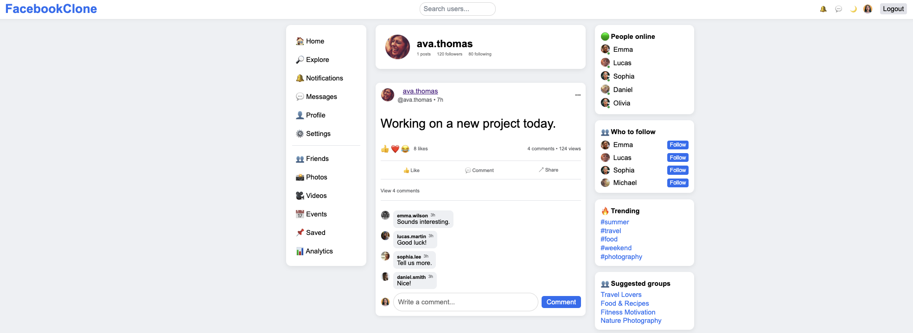
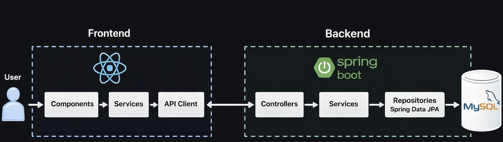

# 🚀 Facebook Clone (Fullstack App)

A modern fullstack social media application inspired by Facebook, built with **React + Spring Boot + MySQL + Docker**.

This project demonstrates a production-like architecture including authentication with JWT, layered backend structure, and containerized deployment.

---

# 🧠 Tech Stack

### Backend
- Java 17
- Spring Boot
- Spring Security (JWT)
- Spring Data JPA / Hibernate
- Liquibase (database migrations)

### Frontend
- React
- Vite
- Axios

### Database
- MySQL (Docker)

### DevOps
- Docker
- Docker Compose

---

# ✨ Features

- 🔐 User registration & login (JWT)
- 📝 Create posts (with optional image)
- ❤️ Likes / reactions
- 💬 Comments system
- 👥 Friends system
- 📰 User feed
- 🔎 Suggested users & activity

---

# 🏗️ Architecture

Frontend → API → Backend → Database

- Controller → Service → Repository (backend)
- Components → Services → API (frontend)

---

# 🐳 Docker Setup

The application runs in 3 containers:

- backend (Spring Boot)
- frontend (React + nginx)
- mysql (database)

---

# 🚀 Getting Started

## Requirements
- Docker

## Run

```bash
docker-compose up --build
```

## Access

- Frontend: http://localhost:3000
- Backend: http://localhost:8080

---

# 🔐 Authentication (JWT)

Each request includes:

```
Authorization: Bearer <token>
```

---

# 📸 Screenshots

### 🏠 Feed


### 🔐 Login


### 📝 Register


### 👤 Profile + Comments


### 🏗️ Architecture


---

# 📦 Project Structure

```
backend/     -> Spring Boot API  
frontend/    -> React app  
screenshots/ -> images used in README  
```

---

# 💡 Why this project?

- practice fullstack architecture
- implement JWT authentication
- learn Docker in real-world setup
- build social media app

---

# 👨‍💻 Author

Marcin Fundalewicz

---

# 🔥 Summary

Fullstack application with:

- authentication
- database
- Docker environment

Ready to run with a single command.